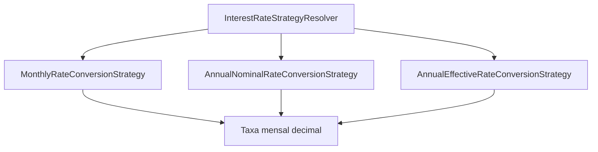
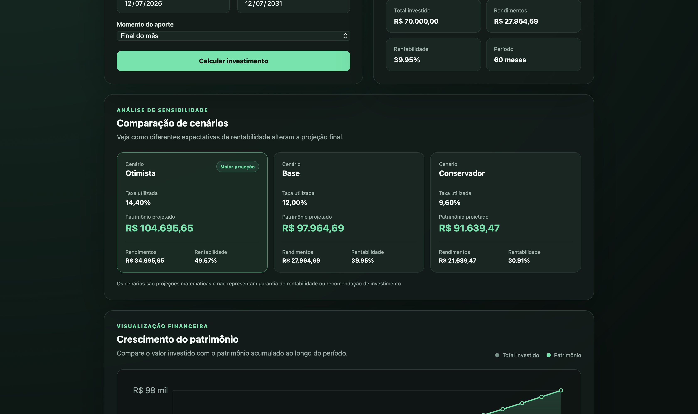
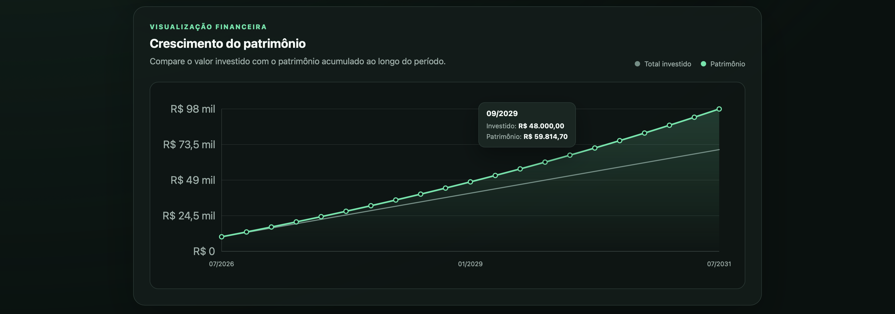
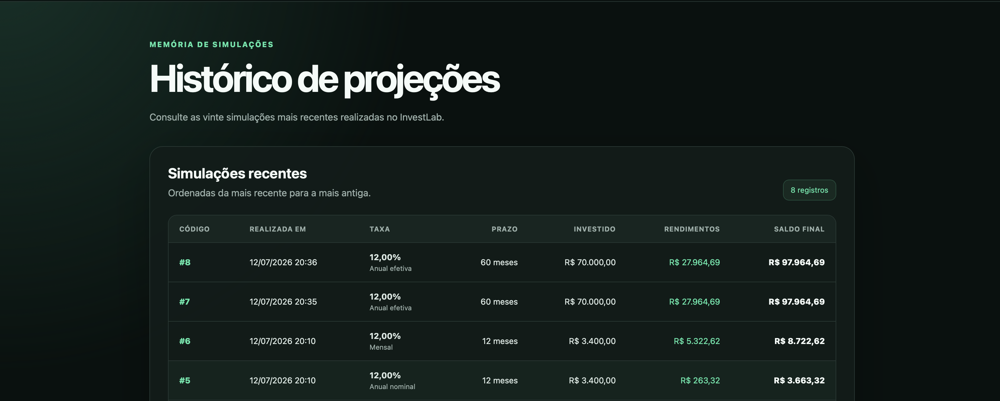
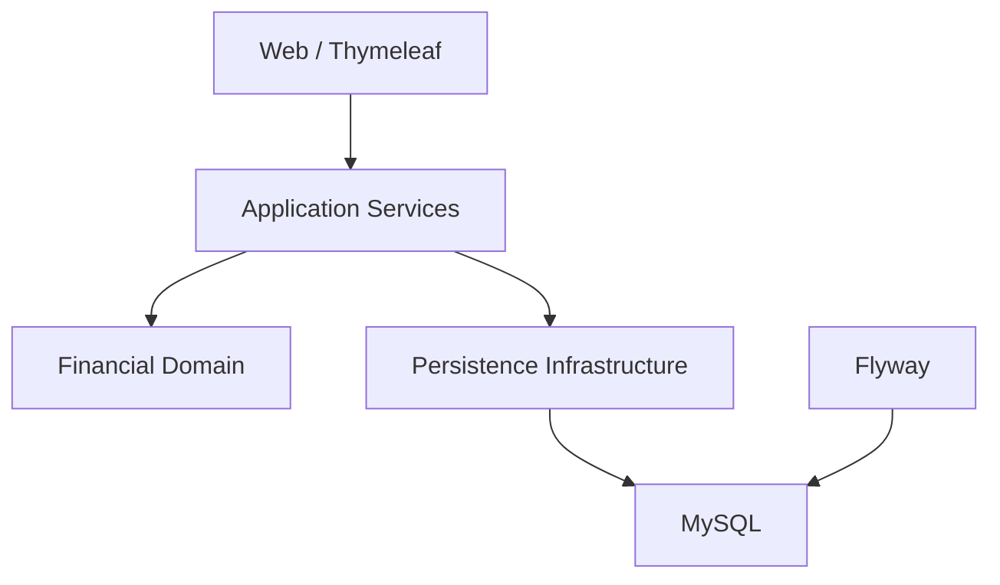

<div align="center">

# 📈 InvestLab

### Plataforma profissional de simulação de investimentos desenvolvida com Java 21, Spring Boot e matemática financeira.

Simulação de juros compostos • Metas financeiras • Comparação de cenários • Evolução patrimonial

<br>

[](https://www.oracle.com/java/)
[](https://spring.io/projects/spring-boot)
[](https://www.thymeleaf.org/)
[](https://www.mysql.com/)

[](https://maven.apache.org/)
[](https://documentation.red-gate.com/flyway)
[](https://railway.com/)
[](#testes-automatizados)

<br>

### [Acessar aplicação online](https://investlab-production-cf75.up.railway.app)

</div>

---

## Sobre o projeto

O **InvestLab** é uma plataforma web para simulação e planejamento de investimentos baseada em matemática financeira.

O projeto foi desenvolvido para ir além de um CRUD tradicional. Seu núcleo é composto por regras de negócio, cálculos financeiros, conversão de taxas, projeções mensais e comparação de cenários.

A aplicação permite analisar o crescimento de um patrimônio, acompanhar aportes e rendimentos, estabelecer metas financeiras e consultar o histórico das simulações realizadas.

O desenvolvimento teve como principais objetivos:

- aprofundar conhecimentos em Java;
- trabalhar com precisão monetária usando `BigDecimal`;
- implementar matemática financeira;
- modelar regras de negócio;
- aplicar padrões de projeto;
- separar domínio, aplicação, infraestrutura e interface;
- construir uma aplicação completa e disponível em produção.

> O InvestLab possui finalidade educacional e demonstrativa. As projeções não representam garantia de rentabilidade nem recomendação de investimento.

---

## Visão geral


---

## Principais funcionalidades

### Simulador de investimentos

Permite criar projeções utilizando:

- investimento inicial;
- aporte mensal;
- taxa de juros;
- periodicidade da taxa;
- data inicial;
- data final;
- aporte no início ou no final do período.

O resultado apresenta:

- saldo final;
- total investido;
- rendimentos acumulados;
- rentabilidade;
- quantidade de meses;
- evolução completa mês a mês.

### Tipos de taxa

O InvestLab trabalha com três formas de entrada:

- taxa mensal;
- taxa anual nominal;
- taxa anual efetiva.

Cada tipo utiliza uma estratégia própria para conversão em taxa mensal.

### Meta financeira

O usuário informa um patrimônio desejado e o sistema calcula:

- quantidade de meses necessária;
- data estimada para atingir a meta;
- total aportado;
- rendimentos acumulados;
- saldo projetado;
- evolução patrimonial até o objetivo.

### Comparação de cenários

A aplicação gera automaticamente três projeções:

| Cenário | Multiplicador |
|---|---:|
| Conservador | 80% da taxa informada |
| Base | 100% da taxa informada |
| Otimista | 120% da taxa informada |

Os resultados são ordenados por saldo final utilizando `Stream`, `Comparator` e lambdas.

### Evolução patrimonial

Cada simulação produz uma coleção com o detalhamento mensal:

- número do mês;
- data de referência;
- saldo inicial;
- aporte;
- juros recebidos;
- saldo final;
- total investido;
- juros acumulados.

### Gráfico interativo

O gráfico compara:

- total investido;
- patrimônio acumulado.

Também possui:

- tooltip com valores mensais;
- adaptação para períodos longos;
- formatação monetária;
- redimensionamento responsivo;
- redução inteligente de marcadores.

### Histórico

As simulações principais são persistidas no MySQL.

O histórico exibe:

- código;
- data de criação;
- taxa utilizada;
- prazo;
- total investido;
- rendimentos;
- saldo final.

### Detalhes salvos

Uma simulação pode ser reconstruída a partir do histórico.

O sistema recupera os parâmetros persistidos e recalcula:

- resumo;
- comparação de cenários;
- gráfico;
- evolução mensal.

### Tratamento de erros

A aplicação possui páginas próprias para:

- recurso não encontrado — `404`;
- erro interno — `500`.

Informações técnicas e stack traces não são expostos ao usuário.

---

## Motor financeiro

O núcleo da aplicação utiliza `BigDecimal` para evitar os problemas de precisão presentes em `double` e `float`.

Os valores monetários são arredondados com:

```java
RoundingMode.HALF_EVEN
```

Esse modo reduz o viés acumulado em sequências extensas de operações.

### Juros compostos

A evolução mensal segue o princípio:

$$
M = C \times (1 + i)^n
$$

Onde:

- `M` representa o montante;
- `C` representa o capital;
- `i` representa a taxa;
- `n` representa o número de períodos.

Como o InvestLab aceita aportes recorrentes e diferentes momentos de contribuição, o cálculo é executado mês a mês em vez de utilizar somente uma fórmula final.

### Taxa mensal

Uma taxa mensal percentual é convertida para decimal:

$$
i_m = \frac{taxa}{100}
$$

Exemplo:

```text
1% ao mês = 0,01
```

### Taxa anual nominal

A taxa anual nominal é convertida proporcionalmente:

$$
i_m = \frac{i_a}{12}
$$

Exemplo:

```text
12% ao ano nominal = 1% ao mês
```

### Taxa anual efetiva

A taxa anual efetiva exige uma taxa mensal equivalente:

$$
i_m = (1 + i_a)^{\frac{1}{12}} - 1
$$

Como `BigDecimal` não calcula diretamente potências fracionárias, o InvestLab utiliza o método numérico de **Newton-Raphson** para calcular a raiz de décimo segundo grau mantendo alta precisão.

Exemplo:

```text
12% ao ano efetivos ≈ 0,948879% ao mês
```

---

## Strategy Pattern

A conversão de taxas foi implementada com Strategy Pattern.



Cada estratégia implementa o contrato:

```java
public interface InterestRateConversionStrategy {

    boolean supports(RatePeriod ratePeriod);

    BigDecimal convertToMonthlyRate(
            BigDecimal interestRatePercentage
    );
}
```

O resolver utiliza Streams e `Optional` para localizar a estratégia compatível:

```java
return strategies.stream()
        .filter(strategy -> strategy.supports(ratePeriod))
        .findFirst()
        .orElseThrow(...);
```

Essa estrutura permite adicionar novas formas de rentabilidade sem concentrar todas as decisões em uma única classe.

---

## Comparação de cenários



---

## Crescimento do patrimônio



---

## Meta financeira


---

## Histórico de simulações



---

## Detalhes da simulação


---

## Página personalizada de erro


---

## Arquitetura

O InvestLab utiliza uma arquitetura em camadas orientada ao domínio.



### Domínio

Contém:

- records financeiros;
- enums;
- validações;
- exceptions;
- serviços de cálculo;
- estratégias de conversão.

O domínio não depende de Spring MVC, Thymeleaf, JPA ou MySQL.

### Aplicação

Responsável por coordenar casos de uso como:

- salvar simulações;
- consultar histórico;
- reconstruir detalhes.

### Infraestrutura

Contém:

- Entity JPA;
- Repository;
- Mapper;
- integração com MySQL.

### Web

Responsável por:

- controllers;
- formulários;
- validação de entrada;
- templates Thymeleaf;
- recursos estáticos.

---

## Estrutura do projeto

```text
src
├── main
│   ├── java/com/kayque/investlab
│   │   ├── application
│   │   │   ├── dto
│   │   │   └── service
│   │   ├── config
│   │   ├── domain
│   │   │   ├── enums
│   │   │   ├── exception
│   │   │   ├── model
│   │   │   ├── service
│   │   │   ├── strategy
│   │   │   └── validation
│   │   ├── infrastructure
│   │   │   └── persistence
│   │   │       ├── entity
│   │   │       ├── mapper
│   │   │       └── repository
│   │   ├── web
│   │   │   ├── controller
│   │   │   └── form
│   │   └── InvestlabApplication
│   └── resources
│       ├── db/migration
│       ├── static
│       │   ├── css
│       │   └── js
│       ├── templates
│       │   ├── error
│       │   └── fragments
│       ├── application.properties
│       └── application-prod.properties
└── test
    ├── java/com/kayque/investlab
    │   ├── domain/service
    │   └── domain/strategy
    └── resources
        └── application-test.properties
```

---

## Persistência

As simulações são armazenadas em MySQL.

A tabela principal guarda:

- parâmetros de entrada;
- tipo de taxa;
- período;
- momento do aporte;
- resumo financeiro;
- data de criação.

A evolução mensal não é armazenada. Ela é recalculada deterministicamente a partir dos parâmetros salvos.

Essa decisão:

- reduz a quantidade de registros;
- evita duplicação de dados derivados;
- mantém o histórico reconstruível;
- centraliza os cálculos no motor financeiro.

### Flyway

O schema é versionado por migrations:

```text
src/main/resources/db/migration
└── V1__create_simulations_table.sql
```

O Flyway também cria:

```text
flyway_schema_history
```

Essa tabela registra quais migrations foram executadas.

---

## Post/Redirect/Get

Após uma simulação:

```text
POST /simulate
→ cálculo
→ persistência
→ redirect
→ GET /?simulationId={id}
```

O padrão evita que uma atualização do navegador envie novamente o formulário e crie registros duplicados.

---

## Validações e limites

A aplicação protege o motor contra entradas inválidas ou exageradas.

| Regra | Limite |
|---|---:|
| Valor monetário máximo | R$ 99.999.999.999.999.999,99 |
| Taxa máxima | 1.000% |
| Prazo máximo | 1.200 meses |
| Meta máxima | R$ 99.999.999.999.999.999,99 |

Também são rejeitados:

- valores negativos;
- datas inválidas;
- períodos incompletos;
- prazo maior que 100 anos;
- meta sem aporte e sem rentabilidade;
- investimento inicial e aporte simultaneamente iguais a zero.

---

## Testes automatizados

O projeto possui testes para as principais regras financeiras:

- conversão de taxa mensal;
- conversão anual nominal;
- conversão anual efetiva;
- taxa efetiva igual a zero;
- aportes no início do período;
- aportes no final do período;
- equivalência entre taxas;
- imutabilidade da evolução mensal;
- cálculo de meta financeira;
- meta já alcançada;
- meta impossível sem crescimento;
- inicialização do contexto Spring.

Execute:

```bash
./mvnw clean test
```

Resultado esperado:

```text
Tests run: 12
Failures: 0
Errors: 0
BUILD SUCCESS
```

O teste de contexto utiliza H2 em memória e não depende de um MySQL externo durante o build.

---

## Tecnologias

### Backend

- Java 21
- Spring Boot 3.5.16
- Spring MVC
- Spring Data JPA
- Jakarta Validation
- Maven

### Interface

- Thymeleaf
- HTML5
- CSS3
- JavaScript
- Canvas API

### Persistência

- MySQL
- Hibernate
- Flyway
- HikariCP
- H2 para testes

### Infraestrutura

- Railway
- Railpack
- GitHub
- Health check com Spring Boot Actuator

### Conceitos aplicados

- BigDecimal
- LocalDate e LocalDateTime
- Enums
- Records
- Streams
- Collections
- Comparator
- Optional
- Lambdas
- Strategy Pattern
- Service Layer
- Repository Pattern
- Mapper
- Post/Redirect/Get
- arquitetura orientada ao domínio

---

## Como executar localmente

### Pré-requisitos

- Java 21
- MySQL
- Git
- Maven Wrapper incluído no projeto

### 1. Clone o repositório

```bash
git clone https://github.com/kayquemigueldev/investlab.git
```

### 2. Entre na pasta

```bash
cd investlab
```

### 3. Crie o banco

```sql
CREATE DATABASE investlab
    CHARACTER SET utf8mb4
    COLLATE utf8mb4_unicode_ci;
```

### 4. Configure as variáveis

A aplicação possui valores padrão para desenvolvimento:

```text
DB_URL=jdbc:mysql://localhost:3306/investlab
DB_USERNAME=root
DB_PASSWORD=
```

Se seu ambiente utilizar outras credenciais:

```bash
export DB_URL="jdbc:mysql://localhost:3306/investlab?useSSL=false&allowPublicKeyRetrieval=true&serverTimezone=America/Sao_Paulo"
export DB_USERNAME="root"
export DB_PASSWORD="sua_senha"
```

Não armazene senhas diretamente no Git.

### 5. Execute os testes

```bash
./mvnw clean test
```

### 6. Inicie a aplicação

```bash
./mvnw spring-boot:run
```

Acesse:

```text
http://localhost:8080
```

O Flyway executará automaticamente as migrations necessárias.

### 7. Health check

```text
http://localhost:8080/actuator/health
```

Resposta esperada:

```json
{
  "status": "UP"
}
```

---

## Deploy

A aplicação está publicada na Railway:

### [investlab-production-cf75.up.railway.app](https://investlab-production-cf75.up.railway.app)

A infraestrutura possui dois serviços:

```text
InvestLab Application
└── MySQL
```

O deploy utiliza:

- build Maven;
- testes automatizados;
- profile `prod`;
- variáveis referenciadas do MySQL;
- Flyway;
- health check;
- restart em caso de falha;
- volume persistente para o banco.

A configuração está versionada em:

```text
railway.toml
```

---

## Observações

- O histórico é compartilhado entre os visitantes da demonstração.
- Nenhum dado pessoal é solicitado ou armazenado.
- As projeções utilizam taxas constantes ao longo do período.
- Impostos, inflação, taxas administrativas e volatilidade ainda não são considerados.
- Os resultados representam simulações matemáticas, não previsões garantidas.

---

## Roadmap

Possíveis evoluções para uma V2:

- autenticação de usuários;
- históricos individuais;
- comparação entre produtos financeiros;
- inflação e ganho real;
- imposto de renda regressivo;
- CDI, Selic e IPCA;
- taxas administrativas;
- exportação em PDF ou CSV;
- cenários personalizados;
- testes de integração com Testcontainers;
- internacionalização;
- tema claro;
- domínio personalizado.

---

## Autor

**Kayque Miguel da Fonseca Reis Galvão**

Sistemas de Informação • Desenvolvedor Java

GitHub: [github.com/kayquemigueldev](https://github.com/kayquemigueldev)

Portfólio: [kayquemiguel.dev](https://kayquemiguel.dev)

---

<div align="center">

Desenvolvido com Java, matemática financeira e muita vontade de aprender.

**InvestLab © 2026**

</div>